---

# WEBD 3100 — Web Design Fundamentals

## Workshop 02 — Visual Design Principles & Usability Heuristics

---

# 1. Workshop Details

|                    |                                                    |
| ------------------ | -------------------------------------------------- |
| **Course**         | WEBD 3100 — Web Design Fundamentals                |
| **Instructor**     | Davis Boudreau                                     |
| **Workshop**       | Workshop 02                                        |
| **Title**          | Visual Design Principles & Usability Heuristics    |
| **Term**           | Fall 2026                                          |
| **Weight**         | 4%                                                 |
| **Type**           | Guided Analysis, Figma Design & Usability Workshop |
| **Estimated Time** | Approximately 3 hours                              |
| **Prerequisite**   | Workshop 01 — Website Design Critique              |
| **Tools**          | Browser, Figma, screenshot capability, Brightspace |
| **Submission**     | Workshop 02 Student Submission Template            |

---

# 2. Topic Alignment

Workshop 02 directly supports:

## Topic 2 — Visual Design Principles & Usability Heuristics

You will investigate and apply:

* visual hierarchy;
* balance;
* alignment;
* proximity;
* repetition;
* contrast;
* whitespace;
* CRAP principles;
* Figma layout tools; and
* Nielsen's 10 Usability Heuristics.

You will use these concepts to **evaluate and improve real web interfaces**.

---

# 3. Overview

In Workshop 01, you learned to move beyond personal reactions such as:

> “I like this website.”

or:

> “This page is confusing.”

Instead, you began using:

**Observation → Evidence → Interpretation → Recommendation**

Workshop 02 develops this further.

You will now learn recognized visual-design principles and usability heuristics that help explain **why** an interface works or does not work.

You will also begin using **Figma layout tools** to turn those principles into actual interface designs.

The workshop therefore moves through three connected activities:

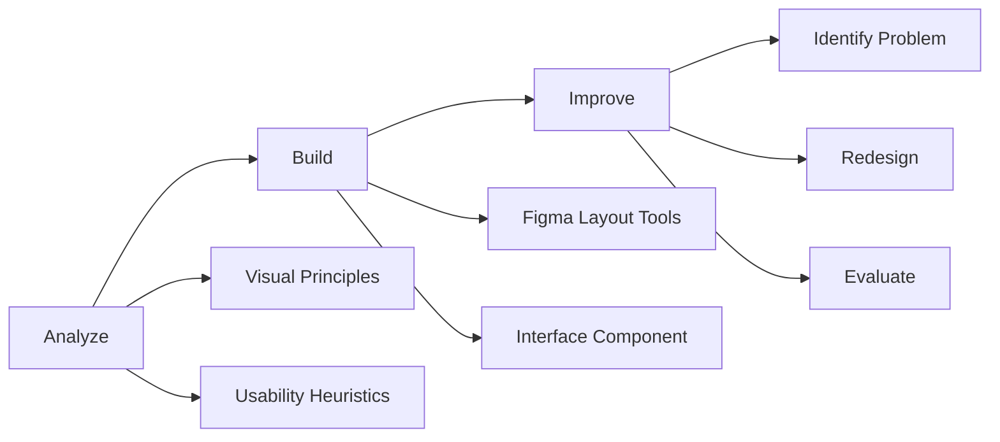

You are moving from:

**Recognizing design**

toward:

**Creating intentional design.**

---

# 4. Learning Journey

Workshop 02 follows this learning process:

```mermaid
flowchart LR
    A[Prior Knowledge] --> B[Learn Principles]
    B --> C[Analyze Interface]
    C --> D[Learn Figma Tools]
    D --> E[Build Component]
    E --> F[Apply Heuristics]
    F --> G[Identify Problem]
    G --> H[Redesign]
    H --> I[Peer Critique]
    I --> J[Refine]
    J --> K[Reflect]
```

Each activity prepares you for the next.

Do not skip directly to the redesign.

The analysis provides the reasoning for your design decisions.

---

# 5. Learning Objectives

By the end of this workshop, you should be able to:

* explain visual hierarchy;
* recognize balance in interface layouts;
* evaluate alignment;
* use proximity to identify relationships;
* recognize repetition and consistency;
* evaluate contrast;
* explain the role of whitespace;
* apply CRAP principles;
* use Figma frames and layout tools;
* use Auto Layout;
* control spacing, padding, alignment, and distribution;
* recognize how Figma tools support visual-design principles;
* explain Nielsen's 10 Usability Heuristics;
* apply usability heuristics to real interfaces;
* support design findings with evidence;
* redesign an interface problem in Figma;
* explain the reasoning behind a design change;
* participate in peer critique; and
* reflect on your developing design process.

---

# 6. Learning Outcome

This workshop primarily supports:

**Outcome 1 — Apply design principles to web design fundamentals in terms of content presentation.**

It also establishes design practices you will use throughout the:

## Integrated Full-Stack Web Application Project

---

# 7. Before We Begin — Prior Knowledge Check

Before reading the design principles, examine an interface provided by your instructor.

Work **individually**.

Spend approximately five minutes examining the interface.

Do not search for design rules yet.

Answer:

## Visual Strength

What appears visually effective?

## Visual Problem

What appears visually ineffective?

## Usability Problem

What might make this interface difficult to use?

## Recommendation

What would you change?

---

# 8. Check Your Existing Knowledge

Without looking up definitions, explain what you think each term means:

* Visual Hierarchy
* Balance
* Alignment
* Proximity
* Repetition
* Contrast
* Whitespace
* Usability

Have you previously used:

* Figma Auto Layout?
* Layout grids?
* Nielsen's Usability Heuristics?

There are no penalties for not knowing these concepts.

This establishes your starting point.

---

# 9. From Workshop 01 to Workshop 02

Workshop 01 used:

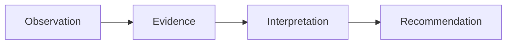

Workshop 02 expands this:

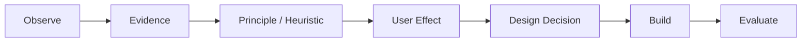

You should increasingly be able to explain:

> **What did I observe?**

> **What principle helps explain it?**

> **What evidence supports my conclusion?**

> **How could it affect the user?**

> **What should I change?**

---

# PART A — VISUAL DESIGN PRINCIPLES

# 10. Visual Hierarchy

Visual hierarchy answers:

> **What should the user notice first?**

and:

> **What should the user notice next?**

Hierarchy can be created through:

* size;
* typography;
* weight;
* colour;
* contrast;
* position;
* spacing;
* imagery; and
* grouping.

A page might communicate:

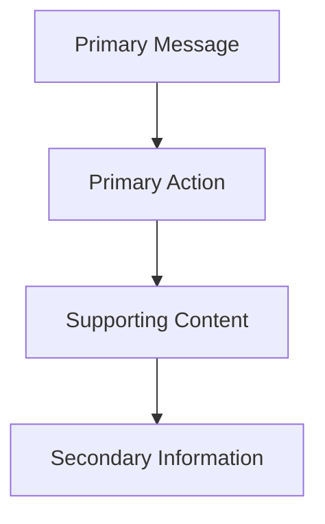

These elements should not necessarily have equal visual emphasis.

## Ask

Can you identify the most important information within a few seconds?

---

# 11. Balance

Balance describes how visual weight is distributed across a design.

Balance does **not** mean everything must be symmetrical.

Visual weight can be influenced by:

* size;
* colour;
* imagery;
* typography;
* whitespace;
* position; and
* density.

A design can be asymmetrical and still feel balanced.

## Ask

Does one area dominate unnecessarily?

Does the layout feel intentional?

---

# 12. Alignment

Alignment creates visual relationships between elements.

Elements that share alignment often appear connected.

Poor alignment can make an interface appear:

* disorganized;
* inconsistent;
* difficult to scan; or
* unintentionally fragmented.

Imagine invisible lines connecting the elements in an interface.

## Ask

Do these elements appear intentionally connected?

---

# 13. Proximity

Elements positioned close together are often perceived as related.

For example:

```text
Product Name
Price
Description
Add to Cart
```

These elements might belong to one product card.

Spacing helps communicate that relationship.

## Ask

Does the spacing make it obvious which elements belong together?

---

# 14. Repetition

Repetition creates consistency.

Interfaces commonly repeat:

* colours;
* typography;
* spacing;
* buttons;
* cards;
* icons;
* headings;
* borders; and
* interaction patterns.

Repeated patterns help users learn how the interface works.

## Ask

Do similar things look and behave similarly?

---

# 15. Contrast

Contrast creates meaningful differences.

Contrast can involve:

* colour;
* size;
* weight;
* shape;
* typography;
* spacing; and
* position.

Contrast can distinguish:

**Heading vs. Paragraph**

**Primary vs. Secondary Action**

**Selected vs. Unselected**

**Navigation vs. Content**

**Important vs. Supporting Information**

## Ask

Does the difference communicate meaning?

---

# 16. Whitespace

Whitespace is the unused space surrounding and separating elements.

Whitespace is not wasted space.

It can:

* improve readability;
* separate groups;
* create hierarchy;
* reduce visual competition;
* emphasize important content; and
* improve scanning.

## Ask

Does the interface give content enough room to communicate clearly?

---

# 17. CRAP Principles

Four foundational principles can be remembered as:

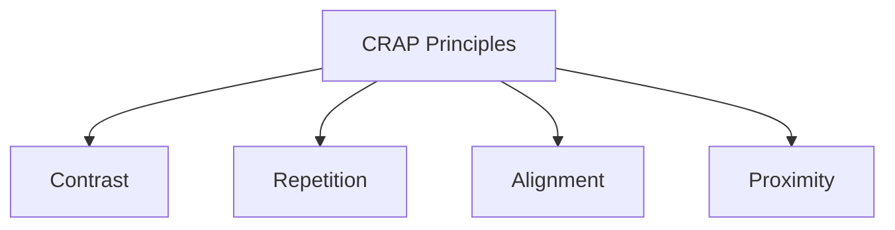

## Contrast

Create meaningful differences.

## Repetition

Create consistency.

## Alignment

Create visual relationships.

## Proximity

Group related information.

Together, they help users:

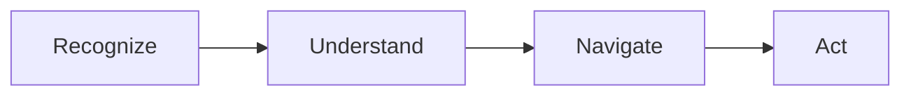

---

# 18. Design Principles Work Together

Design problems rarely involve only one principle.

Consider a group of confusing controls.

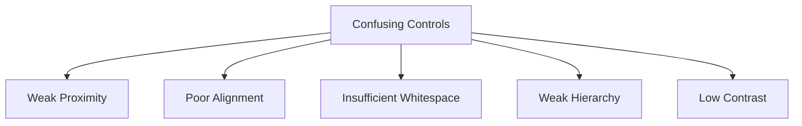

Your objective is not to identify the greatest possible number of principles.

Identify the principles that **best explain what you observe**.

---

# 19. Task 1 — Visual Principle Hunt

Select a website assigned or approved by the instructor.

Explore:

* the Home page;
* navigation;
* at least two additional pages; and
* important interface components.

Find an example of each:

1. Visual Hierarchy
2. Balance
3. Alignment
4. Proximity
5. Repetition
6. Contrast
7. Whitespace

For each:

### Identify

What interface element are you examining?

### Evidence

What can you actually observe?

### Effect

How does the design decision affect the user?

### Assessment

Is the principle:

* Effective;
* Mixed; or
* Needs Improvement?

Capture screenshots where appropriate.

---

# 20. Task 2 — CRAP Analysis

Choose **one page** from the website.

Analyze it using:

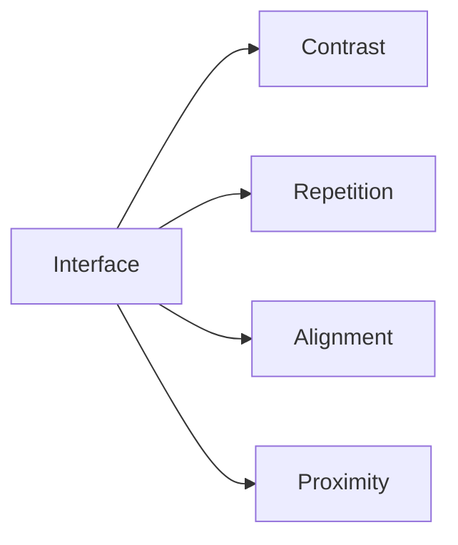

For each principle determine:

**Effective**

**Mixed**

or:

**Needs Improvement**

Then explain why.

Use:

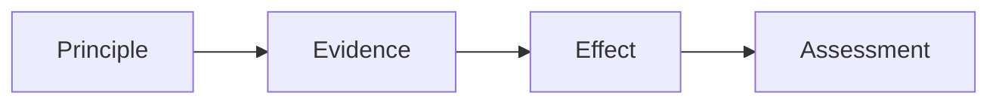

Do not write:

> “The page has good contrast.”

Explain:

> **What creates the contrast, what it differentiates, and how that affects the user.**

---

# PART B — FIGMA LAYOUT TOOLS

# 21. From Principle to Tool

Recognizing design principles is only the beginning.

Designers also need tools for implementing those decisions.

Figma provides layout tools that help translate visual principles into structured interfaces.

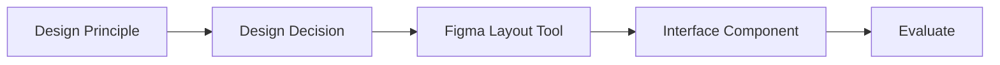

In this section, you will build a simple component while learning the Figma tools.

---

# 22. Figma Layout Tools

You will work with:

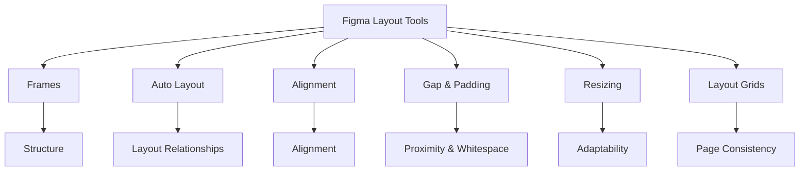

---

# 23. Frames

A **Frame** is a container used to organize interface elements.

Frames can represent:

* pages;
* sections;
* cards;
* navigation;
* forms;
* components;
* mobile screens;
* desktop screens.

Frames help establish structure.

Think of a frame as:

**A defined area containing related interface elements.**

---

# 24. Auto Layout

Auto Layout allows elements inside a frame to respond systematically to:

* content;
* spacing;
* padding;
* alignment; and
* resizing.

Instead of manually positioning every element, you define relationships between them.

This is particularly useful for:

* buttons;
* cards;
* navigation;
* lists;
* forms;
* menus; and
* repeated components.

---

# 25. Gap and Padding

These two concepts are important.

## Gap

The space **between elements**.

## Padding

The space **inside the container around its content**.

Conceptually:

```text
┌─────────────────────────────┐
│          Padding            │
│   ┌─────────────────────┐   │
│   │      Content        │   │
│   └─────────────────────┘   │
│          Padding            │
└─────────────────────────────┘
```

Gap and padding directly influence:

* proximity;
* whitespace;
* grouping;
* readability.

---

# 26. Alignment

Figma alignment controls help establish consistent relationships between elements.

You can align items:

* left;
* centre;
* right;
* top;
* middle;
* bottom.

Alignment should be intentional.

Do not simply centre everything because the tool allows it.

---

# 27. Resizing

Responsive components need to adapt.

Figma provides resizing behaviours that help elements respond to content and available space.

Depending on the interface, elements may:

* fit their content;
* fill available space; or
* maintain a defined size.

You will explore these behaviours as you build your component.

---

# 28. Layout Grids

Layout grids help organize larger page structures.

They can support:

* consistent margins;
* columns;
* alignment;
* predictable spacing; and
* responsive planning.

Layout grids are particularly useful when moving from isolated components toward complete page layouts.

---

# 29. Task 3 — Build a Card in Figma

You will now build a small interface component.

Create a new Figma file or page named:

**WEBD3100 — Workshop 02 — Your Name**

---

## Step 1 — Create a Frame

Create a frame that will contain your card.

Your card will contain:

**Image**

↓

**Category**

↓

**Heading**

↓

**Description**

↓

**Button**

---

## Step 2 — Add the Content

Add:

### Image Placeholder

Create a rectangle representing an image.

### Category

Example:

**EVENT**

### Heading

Example:

**Introduction to Web Design**

### Description

Add two or three lines of supporting text.

### Button

Add:

**View Details**

---

## Step 3 — Examine the Manual Layout

Before using Auto Layout, examine the component.

Ask:

* Are elements aligned?
* Is spacing consistent?
* Which elements belong together?
* Is there enough whitespace?
* Is the heading clearly more important than the description?
* Does the button appear actionable?

---

# 30. Task 4 — Apply Auto Layout

Select the appropriate card content and apply **Auto Layout**.

Experiment with:

* vertical direction;
* alignment;
* gap;
* padding.

Do not randomly adjust values.

Observe what each change does.

---

## Checkpoint

You should be able to explain:

**Gap controls ____________________.**

**Padding controls ____________________.**

**Alignment controls ____________________.**

**Auto Layout helps because ____________________.**

---

# 31. Apply the Visual Principles

Now intentionally improve the card.

## Hierarchy

Make the heading more prominent than supporting content.

## Contrast

Ensure important elements are visually distinguishable.

## Alignment

Create consistent alignment.

## Proximity

Keep related elements appropriately grouped.

## Repetition

Use consistent typography and spacing.

## Whitespace

Give content enough space to communicate clearly.

## Balance

Examine the visual weight of the image, text, and button.

---

# 32. Duplicate the Component

Duplicate your card two or three times.

Change:

* image;
* heading;
* description;
* category.

Do **not** redesign each card independently.

The cards should appear to belong to the same system.

Observe how repetition creates consistency.

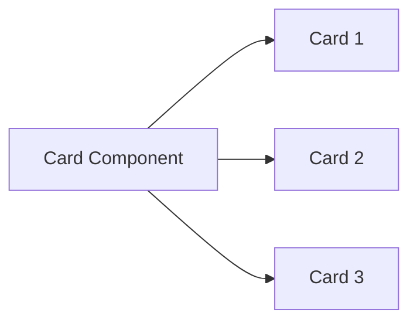

---

# 33. Arrange the Cards

Place the cards inside a larger frame.

Experiment with:

* spacing;
* alignment;
* distribution;
* available width.

If appropriate, add a layout grid.

Consider how the cards might appear on:

**Desktop**

versus:

**Mobile**

You are not building the complete responsive interface yet.

The purpose is to begin thinking about **layout relationships**.

---

# 34. Figma Checkpoint

Before continuing, verify that you have used:

* [ ] Frame
* [ ] Auto Layout
* [ ] Gap
* [ ] Padding
* [ ] Alignment
* [ ] Resizing behaviour
* [ ] Repeated elements
* [ ] Layout grid or page-level alignment where appropriate

You should now understand that Figma layout tools are not separate from design principles.

They help implement them.

---

# PART C — USABILITY HEURISTICS

# 35. What Is a Usability Heuristic?

Visual design asks:

> **How effectively does the interface communicate visually?**

Usability asks:

> **How effectively can users understand and operate the interface?**

A **heuristic** is a broad design principle that helps identify potential usability problems.

One widely used framework is:

## Nielsen's 10 Usability Heuristics

A heuristic is not an automatic pass/fail rule.

It provides a structured way to investigate an interface.

---

# 36. Nielsen's 10 Usability Heuristics

## 1. Visibility of System Status

The interface should keep users informed about what is happening.

Examples:

* loading;
* progress;
* success;
* selected states;
* confirmation.

### Ask

**Does the user know what the system is doing?**

---

## 2. Match Between the System and the Real World

Use language and concepts familiar to users.

### Ask

**Does the interface communicate in language the intended audience understands?**

---

## 3. User Control and Freedom

Users make mistakes and change their minds.

Provide appropriate ways to:

* cancel;
* go back;
* undo;
* close;
* remove;
* change an action.

### Ask

**Can the user recover from an unwanted action?**

---

## 4. Consistency and Standards

Similar elements should look and behave similarly.

### Ask

**Does the interface follow consistent and familiar patterns?**

---

## 5. Error Prevention

Good design attempts to prevent problems before they occur.

Examples:

* appropriate controls;
* clear requirements;
* confirmation of destructive actions;
* preventing impossible choices.

### Ask

**Could the interface prevent this problem?**

---

## 6. Recognition Rather Than Recall

Important information and choices should be visible when needed.

### Ask

**Does the user need to remember information unnecessarily?**

---

## 7. Flexibility and Efficiency of Use

Interfaces should support efficient interaction.

Examples:

* search;
* filters;
* shortcuts;
* saved preferences;
* efficient navigation.

### Ask

**Can users accomplish their task efficiently?**

---

## 8. Aesthetic and Minimalist Design

Avoid unnecessary information competing with important information.

This does not mean every interface must visually appear minimal.

### Ask

**Is unnecessary information competing with the user's task?**

---

## 9. Help Users Recognize, Diagnose and Recover from Errors

Errors should be understandable and actionable.

Instead of:

**Error 4057**

use something meaningful such as:

**Enter an email address to continue.**

### Ask

**Does the user understand what happened and how to recover?**

---

## 10. Help and Documentation

Help should be:

* available when needed;
* understandable;
* task-focused;
* easy to locate.

### Ask

**Can the user find useful help when needed?**

---

# 37. The Heuristic Evaluation Process

Use:

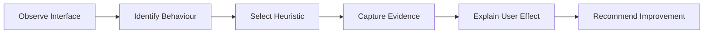

This keeps usability evaluation evidence-based.

---

# 38. Task 5 — Heuristic Hunt

Return to the website used earlier.

Identify at least **five relevant Nielsen heuristics**.

For each:

### Heuristic

Identify the heuristic.

### Interface Element

What are you examining?

### Observation

What happened?

### Evidence

What can you point to?

### Assessment

Is this a:

**Strength**

or:

**Concern**

### User Effect

How could it affect the user?

---

# 39. Example Heuristic Finding

## Heuristic

**Visibility of System Status**

## Observation

After submitting a form, no confirmation or progress message appears.

## Evidence

The interface remains visually unchanged.

## User Effect

The user may not know whether the request was received.

## Recommendation

Provide immediate confirmation or processing feedback.

Notice the progression:

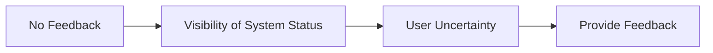

---

# 40. Task 6 — Complete a User Journey

Choose a realistic task on the website.

Examples:

* find information;
* search;
* filter;
* locate a service;
* find a product;
* submit a form;
* register.

Complete the task yourself.

Document the journey.

For example:

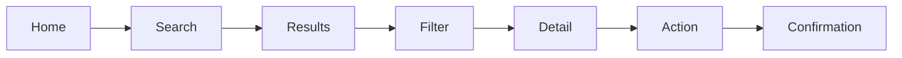

At each stage ask:

* Do I know where I am?
* Do I know what to do next?
* Is important information visible?
* Does the interface respond to my actions?
* Can I recover from mistakes?
* Is the interaction consistent?
* Am I being asked to remember unnecessary information?

Identify where the journey works and where it becomes difficult.

---

# PART D — ANALYZE & REDESIGN

# 41. Task 7 — Select a Significant Interface Problem

Review everything you have discovered.

Choose **one meaningful interface problem**.

Do not automatically choose the easiest problem.

Use:

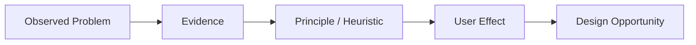

Document:

## Problem

What is happening?

## Evidence

What can you observe?

## Principle / Heuristic

What formal principle helps explain the problem?

## User Effect

How could this affect the user?

---

# 42. Task 8 — Recreate the Problem in Figma

Return to your Workshop 02 Figma file.

Create a new section:

## Interface Redesign

Recreate only enough of the existing interface to demonstrate the selected problem.

You do not need to reproduce the entire website.

Possible areas include:

* navigation;
* hero;
* card;
* form;
* search/filter controls;
* call-to-action;
* content section;
* confirmation;
* error state.

Label the frame:

**Existing Design**

---

# 43. Task 9 — Create the Improved Design

Duplicate the frame.

Label it:

**Proposed Improvement**

Apply what you learned.

Consider:

### Visual Design

* hierarchy;
* balance;
* alignment;
* proximity;
* repetition;
* contrast;
* whitespace.

### Figma Layout

* frames;
* Auto Layout;
* gap;
* padding;
* alignment;
* resizing;
* layout grids.

### Usability

* system status;
* user control;
* consistency;
* error prevention;
* recognition;
* efficiency;
* error recovery;
* help.

Your redesign must respond to the problem you identified.

---

# 44. The Redesign Process

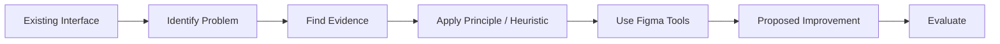

The goal is not:

> **Make it look nicer.**

The goal is:

> **Use evidence and design principles to improve the user experience.**

---

# 45. Task 10 — Compare Before & After

Place:

**Existing Design**

beside:

**Proposed Improvement**

Use:

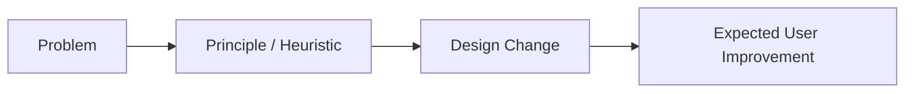

Explain:

## Problem

What needed improvement?

## Principle / Heuristic

What informed your decision?

## Design Change

What did you change?

## Expected Improvement

How should this improve the user's experience?

---

# PART E — PEER CRITIQUE & ITERATION

# 46. Task 11 — Peer Design Critique

Work with another student or small group.

Show:

**Existing Design**

and:

**Proposed Improvement**

Initially, do not explain the entire redesign.

Allow the reviewer to observe it.

Ask:

* What do you notice first?
* What appears to be the primary action?
* What changed?
* Is the revised interface clearer?
* Which visual principles appear to have been applied?
* Does the change address the usability problem?
* Did the redesign introduce another problem?
* Is spacing consistent?
* Does the component feel balanced?
* Is the hierarchy clear?

Then explain your reasoning.

---

# 47. Peer Critique Cycle

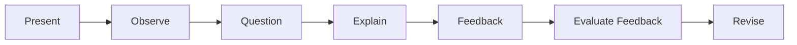

You do not need to accept every recommendation.

You do need to **consider the feedback**.

---

# 48. Task 12 — Revise

Identify:

## Most Useful Feedback

What feedback was most useful?

## Decision

Will you modify the design?

Why or why not?

## Revision

Make appropriate changes.

Your final version should represent your thinking **after critique**.

---

# 49. Final Workshop Checkpoint

Before completing Workshop 02, verify:

## Visual Design

* [ ] Visual hierarchy investigated
* [ ] Balance investigated
* [ ] Alignment investigated
* [ ] Proximity investigated
* [ ] Repetition investigated
* [ ] Contrast investigated
* [ ] Whitespace investigated
* [ ] CRAP analysis completed

## Figma

* [ ] Frame created
* [ ] Auto Layout used
* [ ] Gap adjusted
* [ ] Padding adjusted
* [ ] Alignment used intentionally
* [ ] Resizing explored
* [ ] Repeated cards/components created
* [ ] Layout grid/page alignment explored
* [ ] Existing interface recreated
* [ ] Improved interface created

## Usability

* [ ] Nielsen's 10 heuristics reviewed
* [ ] At least five heuristics investigated
* [ ] User journey completed
* [ ] Evidence collected
* [ ] Significant problem identified
* [ ] Recommendation developed

## Critique

* [ ] Peer critique completed
* [ ] Feedback documented
* [ ] Revision considered
* [ ] Individual reflection completed

---

# PART F — REFLECTION

# 50. Individual Reflection

Complete this section **individually**.

## Before

Before this workshop, how did you decide whether an interface was visually well designed?

## Visual Design

Which visual-design principle changed the way you looked at the interface most?

Explain why.

## Figma

Which Figma layout tool was most useful?

How did it help you apply a design principle?

## Usability

Which Nielsen heuristic helped you identify something you might previously have described only as confusing or poorly designed?

## Redesign

What was the most important design decision you made during the redesign?

## Peer Feedback

What did another student notice that you had not considered?

## Apply

What principle, Figma technique, or usability heuristic do you expect to use in your **Integrated Full-Stack Web Application Project**?

Explain how.

---

# 51. Workshop Evaluation

## Workshop 02 — Visual Design Principles & Usability Heuristics — 4%

Evaluation focuses on **application**, not memorization.

| Area                     | Evidence                                                                      |
| ------------------------ | ----------------------------------------------------------------------------- |
| **Visual Analysis**      | Visual principles are identified and applied appropriately                    |
| **CRAP Analysis**        | Contrast, repetition, alignment, and proximity are evaluated using evidence   |
| **Figma Application**    | Layout tools are used to intentionally create and improve interface structure |
| **Usability Analysis**   | Nielsen heuristics are applied appropriately                                  |
| **Evidence & Reasoning** | Findings connect observations to user effects                                 |
| **Redesign**             | Proposed improvement responds directly to an identified problem               |
| **Participation**        | Student participates in investigation and peer critique                       |
| **Reflection**           | Student demonstrates individual learning and application                      |

The workshop is built around:

```mermaid
flowchart LR
    A[Principle] --> B[Evidence]
    B --> C[User Effect]
    C --> D[Design Decision]
    D --> E[Figma Implementation]
    E --> F[Evaluate]
```

---

# 52. Submission

Submit:

## Workshop 02 — Visual Design Principles & Usability Heuristics Student Submission Template

to the appropriate area in **Brightspace**.

Your submission should include:

* prior-knowledge responses;
* visual-principle analysis;
* CRAP analysis;
* screenshots and evidence;
* Figma card/component exercise;
* heuristic analysis;
* user journey;
* selected design problem;
* existing-interface representation;
* proposed Figma redesign;
* before/after comparison;
* design rationale;
* peer feedback;
* revision evidence;
* individual reflection; and
* Figma file link.

Verify that your Figma sharing permissions allow the instructor to access the file.

---

# 53. Workshop 02 Complete

You began Workshop 02 by examining an interface using your existing knowledge.

You then learned to connect:

**Visual Design**

*

**Figma**

*

**Usability**

```mermaid
flowchart TD
    A[Visual Design Principles] --> D[Intentional Interface Design]
    B[Figma Layout Tools] --> D
    C[Usability Heuristics] --> D

    D --> E[Build]
    E --> F[Evaluate]
    F --> G[Improve]
```

You should now be moving from:

> **“This interface looks good.”**

toward:

> **“I can explain the visual principles involved, implement those principles using layout tools, evaluate the interface using usability heuristics, and improve the design based on evidence.”**

---

# 54. Connection to the Integrated Full-Stack Web Application Project

The skills developed in Workshop 02 will directly influence your integrated project.

You will eventually design components such as:

* headers;
* navigation;
* hero sections;
* calls-to-action;
* cards;
* search interfaces;
* filters;
* forms;
* data lists;
* detail views;
* dashboards;
* status messages;
* error messages; and
* responsive layouts.

Those components become the presentation layer of a larger application:

```mermaid
flowchart LR
    A[User] --> B[HTML / CSS Interface]
    B --> C[JavaScript]
    C --> D[API]
    D --> E[Application / Data Layer]
    E --> F[(Database)]
```

Across the integrated project:

```mermaid
flowchart TD
    A[Integrated Full-Stack Web Application]

    A --> B[WEBD 3100]
    A --> C[PROG 2700]
    A --> D[DBAS 3200]

    B --> B1[Visual Design]
    B --> B2[Figma]
    B --> B3[HTML]
    B --> B4[CSS]

    C --> C1[JavaScript]
    C --> C2[Dynamic Interaction]
    C --> C3[API Consumption]

    D --> D1[Database]
    D --> D2[Data Access]
    D --> D3[Application Logic]
    D --> D4[API]
```

Your responsibility in WEBD 3100 is increasingly clear:

> **Design and build an interface whose decisions can be explained, tested, and improved.**

---

# 55. Next — Workshop 03

## Colour & Typography

Workshop 03 will build directly on the visual-design principles introduced here.

You will investigate how:

**Colour + Typography**

create:

* hierarchy;
* identity;
* readability;
* contrast;
* emphasis;
* consistency; and
* visual communication.

```mermaid
flowchart LR
    A[Visual Design Principles] --> B[Colour & Typography]
    B --> C[Visual Identity]
    C --> D[Style System]
    D --> E[Integrated Project Interface]
```

The learning journey continues:

**Critique → Principles → Layout → Colour & Typography → Style System → Interface Design**
